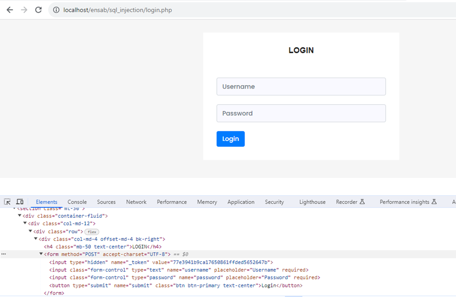

# P-Gen-user
brute force attack using social engineer
# P-Gen - Générateur de Liste de Mots de Passe Personnalisée

P-Gen est un outil basé sur Python pour générer des listes de mots de passe en fonction des informations fournies sur la cible. Il peut aider les professionnels de la sécurité et les hackers éthiques à créer des listes de mots de passe personnalisées pour le craquage de mots de passe et les tests de sécurité.

## Fonctionnalités

- Générer des listes de mots de passe en se basant sur les informations de la cible.
- Inclure des variations de mots de passe en LeetSpeak (leet).
- Ajouter des chiffres et des années aux mots de passe.
- Générer des mots de passe en concaténant des mots courants.
- Créer des mots de passe basés sur des schémas courants de clavier.
- Générer des mots de passe à partir de phrases courantes.
- Générer des mots de passe aléatoires.
- Organiser les mots de passe dans un dossier de sortie.

## Prérequis

- Python 3.x
- Bibliothèques Python nécessaires (peuvent être installées avec `pip`):
  - argparse
  - itertools

## Utilisation

- Clonez le dépôt :

   ```bash
   git clone https://github.com/Mlouak/P-Gen.git
   cd P-Gen
    ```
- Exécutez le script avec les options désirées :    
   
   ```bash 
   python P-Gen.py -l -n -y -c -k -p -r
   ```
    - **-l** ou **--leet** : Générer des mots de passe LeetSpeak.  
    - **-n** ou **--numbers** : Ajouter des chiffres aux mots de passe générés.  
    - **-y** ou **--years** : Ajouter des années aux mots de passe générés.  
    - **-c** ou **--concatenate** : Générer des mots de passe en concaténant des mots courants.  
    - **-k** ou **--keyboard** : Générer des mots de passe basés sur des schémas courants de clavier.     
    - **-p** ou **--phrases** : Générer des mots de passe en utilisant des phrases courantes.   
    - **-r** ou **--random** : Générer des mots de passe aléatoires.

## Exemples
- Pour générer des mots de passe LeetSpeak avec des chiffres et des années :

  ```bash 
  python P-Gen.py -l -n -y
  ```
- Pour générer des mots de passe basés sur des phrases courantes :
  ```bash 
  python P-Gen.py -p
  ```
## Extraction des attributs 'name' à partir de la page login.
Dans cette étape on doit connaître les noms des inputs dans le formulaire donc allez à inspecter les éléments da la page http://localhost/ensab/sql_injection/login.php
<br/><br/>


## Lançement D'attaque
Après la création de votre dictionnaire, vous pouvez lancer votre attaque.

- Mais tout d'abord, installez les dépendances nécessaires :
    ```bash
    pip install requests
    ```

- Ensuite, vous pouvez lancer votre attaque :

    ```bash
     py .\p_gen_attack.py
    ```

## Public Cible

P-Gen est idéal pour les audiences suivantes :

- **Testeurs de Pénétration** : Les professionnels de la sécurité effectuant des tests de pénétration peuvent utiliser P-Gen pour créer des listes de mots de passe basées sur les informations de la cible, améliorant ainsi leurs chances d'identifier des mots de passe faibles.

- **Équipes Rouges** : Les équipes rouges simulant des attaques du monde réel peuvent tirer profit de P-Gen pour générer des listes de mots de passe imitant les choix potentiels de mots de passe des cibles.

- **Enthousiastes de la Sécurité** : Les amateurs de cybersécurité peuvent utiliser P-Gen pour expérimenter avec des techniques de craquage de mots de passe et renforcer leurs connaissances en matière de sécurité des mots de passe.

## Objectif

L'objectif principal de P-Gen est d'aider à :

- **Renforcer la Sécurité** : En permettant la génération de listes de mots de passe personnalisées, P-Gen aide à identifier et à rectifier les vulnérabilités liées aux mots de passe faibles, améliorant ainsi la sécurité globale du système.

- **Sensibilisation à la Sécurité** : P-Gen peut être utilisé pour sensibiliser à la sécurité des mots de passe et à l'importance de mots de passe forts et uniques auprès des utilisateurs finaux et des organisations.
